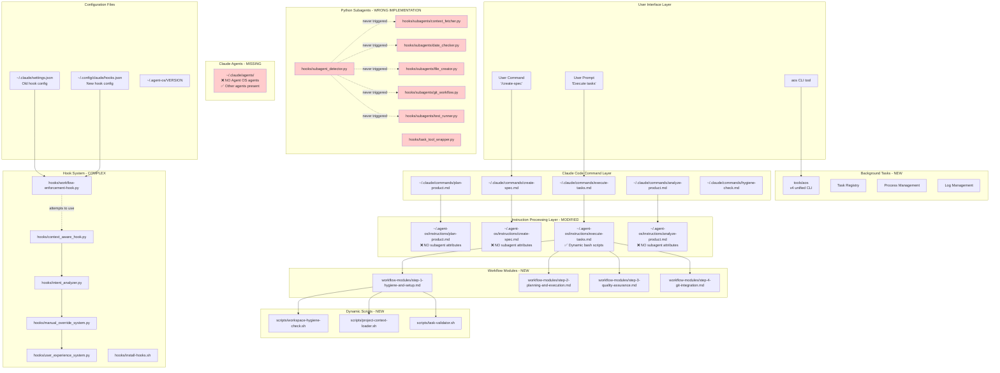

# Agent OS Fork Architecture Analysis

## Current Implementation Overview



## File Structure Comparison

### Our Fork Structure
```
agent-os/
├── setup.sh                           # Modified with our preferences
├── setup-claude-code.sh               # Modified, removed agent installation
├── setup-claude-code-local.sh         # NEW - local testing version
│
├── instructions/                      # Modified from Builder Methods
│   ├── plan-product.md               # NO subagent attributes
│   ├── create-spec.md                # NO subagent attributes
│   ├── execute-tasks.md              # Uses workflow modules instead
│   ├── analyze-product.md            # NO subagent attributes
│   └── hygiene-check.md              # NEW - workspace checking
│
├── workflow-modules/                  # NEW - modular workflow components
│   ├── step-1-hygiene-and-setup.md
│   ├── step-2-planning-and-execution.md
│   ├── step-3-quality-assurance.md
│   └── step-4-git-integration.md
│
├── scripts/                          # NEW - dynamic bash scripts
│   ├── workspace-hygiene-check.sh
│   ├── project-context-loader.sh
│   └── task-validator.sh
│
├── hooks/                            # NEW - complex Python system
│   ├── subagents/                   # WRONG - Python modules not Claude agents
│   │   ├── __init__.py
│   │   ├── context_fetcher.py      # 350+ lines
│   │   ├── date_checker.py         # 400+ lines
│   │   ├── file_creator.py         # 450+ lines
│   │   ├── git_workflow.py         # 600+ lines
│   │   └── test_runner.py          # 650+ lines
│   ├── subagent_detector.py        # 300+ lines - never works
│   ├── task_tool_wrapper.py        # 250+ lines - can't integrate
│   ├── workflow-enforcement-hook.py # v3 context-aware
│   ├── context_aware_hook.py       # 400+ lines
│   ├── intent_analyzer.py          # 400+ lines
│   ├── manual_override_system.py   # 600+ lines
│   └── user_experience_system.py   # 700+ lines
│
├── tools/                           # NEW - CLI tools
│   └── aos                         # 600+ lines unified CLI
│
├── integrations/                    # NEW - attempted integrations
│   └── setup-subagent-integration.sh
│
├── docs/                           # NEW - extensive documentation
│   ├── SUBAGENT_IMPLEMENTATION_SPEC.md
│   ├── BACKGROUND_TASKS_SPEC.md
│   └── [many more]
│
├── .agent-os/                      # Project configuration
│   ├── product/
│   └── specs/
│
└── claude-code/                    # Modified structure
    ├── agents/                     # MISSING - should have .md files
    └── user/
        └── CLAUDE.md
```

## Key Architectural Differences

### 1. Subagent Implementation ❌ COMPLETELY WRONG

**Builder Methods:**
- Simple markdown files in `~/.claude/agents/`
- Instructions have `subagent="name"` attributes
- Claude Code natively recognizes and uses them

**Our Fork:**
- Complex Python modules (3000+ lines of code)
- No integration with Claude Code
- Never actually triggered or used
- Attempted hook-based interception that doesn't work

### 2. Instruction Files ⚠️ MISSING INTEGRATION

**Builder Methods:**
```xml
<step number="4" subagent="date-checker" name="date_determination">
    Use the date-checker subagent to determine...
</step>
```

**Our Fork:**
```markdown
<step number="4" name="date_determination">
    ### Step 4: Date Determination
    [45 lines of complex date logic instead of subagent]
</step>
```

### 3. Workflow Organization ✅ ENHANCED

**Builder Methods:**
- Single large instruction files

**Our Fork:**
- Modular workflow components
- Dynamic bash scripts
- Better separation of concerns

### 4. Hook System 🔧 OVER-ENGINEERED

**Builder Methods:**
- No hooks needed

**Our Fork:**
- Complex Python hook system
- Intent analysis
- Context awareness
- Manual override system
- User experience enhancement
- 3000+ lines of hook code

### 5. Background Tasks ✅ NEW FEATURE

**Builder Methods:**
- Not present

**Our Fork:**
- Full aos CLI tool
- Process management
- Task registry
- Log monitoring

## What Actually Works vs What Doesn't

### ✅ Working Features
1. **Workflow modules** - Modular instruction components
2. **Dynamic scripts** - Bash-based validation and checking
3. **aos CLI** - Background task management
4. **Hook system** - Workflow enforcement (partially)
5. **Standards** - Enhanced with tabs, Python/React defaults

### ❌ Not Working
1. **Subagents** - Complete failure
   - Python modules instead of markdown agents
   - No Claude Code integration
   - Never triggered in practice
   - 3000+ lines of unused code

2. **Task Tool Integration**
   - Can't intercept Task tool
   - Can't modify parameters
   - Can't route to subagents

3. **Agent Definitions**
   - Missing from `~/.claude/agents/`
   - No `subagent` attributes in instructions

## Installation Process Comparison

### Builder Methods
```bash
# 1. Base install
setup.sh → ~/.agent-os/standards/ + instructions/

# 2. Claude Code setup
setup-claude-code.sh → ~/.claude/commands/ + ~/.claude/agents/
```

### Our Fork
```bash
# 1. Base install (modified)
setup.sh → ~/.agent-os/standards/ + instructions/ + workflow-modules/ + scripts/ + hooks/subagents/

# 2. Claude Code setup (broken)
setup-claude-code.sh → ~/.claude/commands/ only (NO agents)

# 3. Hook installation (complex)
~/.agent-os/hooks/install-hooks.sh → Complex Python hooks

# 4. aos tool
tools/install-aos-alias.sh → CLI tool
```

## Performance Impact

### Builder Methods
- Lightweight markdown files
- Native Claude Code integration
- No runtime overhead

### Our Fork
- Heavy Python modules
- Import overhead
- Hook execution overhead
- Never actually provides value

## The Fundamental Problem

**We built a parallel system instead of using Claude Code's native capabilities:**

1. **Created Python code** where markdown was needed
2. **Built detection logic** where attributes were needed
3. **Attempted interception** where delegation was needed
4. **Added complexity** where simplicity was required

## What Should Have Been Done

1. **Copy Builder Methods agent files** to `~/.claude/agents/`
2. **Add subagent attributes** to instruction files
3. **Remove all Python subagent code**
4. **Keep the good additions** (workflow modules, aos tool)

## Wasted Effort Analysis

### Lines of Code Written (Unnecessary)
- `context_fetcher.py`: ~350 lines
- `date_checker.py`: ~400 lines
- `file_creator.py`: ~450 lines
- `git_workflow.py`: ~600 lines
- `test_runner.py`: ~650 lines
- `subagent_detector.py`: ~300 lines
- `task_tool_wrapper.py`: ~250 lines
- `deploy_subagents.py`: ~400 lines
- Test files: ~1000 lines
- **Total: ~4,400 lines of unnecessary Python code**

### What Was Actually Needed
- 5 markdown files (~200 lines each): ~1000 lines total
- Add subagent attributes to instructions: ~50 line changes
- **Total needed: ~1,050 lines**

## Conclusion

Our fork has valuable additions (workflow modules, aos CLI, enhanced standards) but completely failed on the subagent implementation by:
1. Not understanding Claude Code's native agent system
2. Building a complex Python system that can't integrate
3. Missing the simple markdown-based approach
4. Creating 4x more code than needed for 0% functionality

The architecture shows a fundamental misunderstanding of how Claude Code works, attempting to build around it rather than working with it.