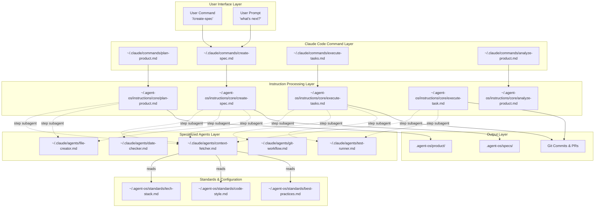

# Builder Methods Agent OS Architecture Diagram

## System Overview



## File Structure and Installation Flow

```
Builder Methods Agent OS
├── setup.sh                          # Main installation script
│   ├── Creates ~/.agent-os/
│   ├── Downloads standards/
│   └── Downloads instructions/
│
├── setup-claude-code.sh              # Claude Code specific setup
│   ├── Creates ~/.claude/commands/
│   ├── Creates ~/.claude/agents/
│   ├── Downloads command files
│   └── Downloads agent definitions
│
└── setup-cursor.sh                   # Cursor specific setup
    └── Creates .cursor/rules/
```

## Detailed Component Breakdown

### 1. Command Files (`~/.claude/commands/`)
Location: `commands/*.md`
Purpose: Entry points for Claude Code slash commands

| File | Command | Points To |
|------|---------|-----------|
| `plan-product.md` | `/plan-product` | `@~/.agent-os/instructions/core/plan-product.md` |
| `create-spec.md` | `/create-spec` | `@~/.agent-os/instructions/core/create-spec.md` |
| `execute-tasks.md` | `/execute-tasks` | `@~/.agent-os/instructions/core/execute-tasks.md` |
| `analyze-product.md` | `/analyze-product` | `@~/.agent-os/instructions/core/analyze-product.md` |

### 2. Instruction Files (`~/.agent-os/instructions/core/`)
Location: `instructions/core/*.md`
Purpose: Detailed workflow instructions with subagent delegation

#### Key Instruction Structure:
```xml
<step number="X" subagent="agent-name" name="step_name">
    Use the [agent-name] subagent to [action]...
</step>
```

### 3. Specialized Agents (`~/.claude/agents/`)
Location: `claude-code/agents/*.md`
Purpose: Specialized AI agents for specific tasks

| Agent | Purpose | Tools Used |
|-------|---------|------------|
| `context-fetcher` | Retrieve and extract information from documentation | Read, Grep, Glob |
| `date-checker` | Determine current date using file system | Bash, Write |
| `file-creator` | Create files from templates | Write, Edit |
| `git-workflow` | Handle git operations and GitHub integration | Bash (git commands) |
| `test-runner` | Execute and analyze test suites | Bash, Read |

### 4. Agent Definition Format

```markdown
---
name: agent-name
description: What this agent does
tools: Tool1, Tool2, Tool3
color: blue
---

You are a specialized [role]. Your responsibilities are...

## Core Responsibilities
1. ...
2. ...

## Workflow
1. ...
2. ...
```

## Execution Flow Trace

### Example: `/create-spec` Command

```
1. User types: /create-spec
   └─> ~/.claude/commands/create-spec.md

2. Command file references:
   └─> @~/.agent-os/instructions/core/create-spec.md

3. Instruction file contains steps with subagents:
   
   Step 1: subagent="context-fetcher"
   └─> Loads ~/.claude/agents/context-fetcher.md
   └─> Reads roadmap.md to find next task
   
   Step 2: subagent="context-fetcher"
   └─> Gathers product context
   └─> Reads mission-lite.md, tech-stack.md
   
   Step 3: subagent="context-fetcher"
   └─> Clarifies requirements
   
   Step 4: subagent="date-checker"
   └─> Creates temp file to get system date
   └─> Returns YYYY-MM-DD format
   
   Step 5: subagent="file-creator"
   └─> Creates spec folder structure
   
   Step 6: subagent="file-creator"
   └─> Creates spec.md from template
   
   Step 7: subagent="file-creator"
   └─> Creates spec-lite.md
   
   Steps 8-12: Additional file-creator calls
   └─> Creates technical specs, tasks.md
```

## Key Functions and Patterns

### 1. Subagent Invocation Pattern
```xml
<step number="4" subagent="date-checker" name="date_determination">
### Step 4: Date Determination
Use the date-checker subagent to determine the current date...
</step>
```

### 2. Context Minimization Pattern
The `context-fetcher` agent checks if information is already in context:
```markdown
1. Check if requested information is already in context
2. If not in context, locate the requested file(s)
3. Extract only relevant sections
4. Return specific information needed
```

### 3. Template-Based File Creation
The `file-creator` agent uses predefined templates:
```markdown
Use the file-creator subagent to create file: [path] using this template:
[template content]
```

## Installation Process

```bash
# 1. Base Installation (setup.sh)
curl -sSL https://raw.githubusercontent.com/buildermethods/agent-os/main/setup.sh | bash
# Creates:
#   ~/.agent-os/standards/
#   ~/.agent-os/instructions/

# 2. Claude Code Setup (setup-claude-code.sh)
curl -sSL https://raw.githubusercontent.com/buildermethods/agent-os/main/setup-claude-code.sh | bash
# Creates:
#   ~/.claude/commands/
#   ~/.claude/agents/
# Downloads:
#   4 command files
#   5 agent definitions
```

## Data Flow

```
User Input
    ↓
Claude Code Command (/command)
    ↓
Command File (references instruction)
    ↓
Instruction File (contains steps with subagents)
    ↓
For each step with subagent attribute:
    ├─> Load agent definition from ~/.claude/agents/
    ├─> Agent executes with specific tools
    ├─> Agent returns focused results
    └─> Continue to next step
    ↓
Output (files, folders, git operations)
```

## Key Differences from Standard Claude Code

1. **Specialized Agents**: Instead of using general-purpose Claude, specific agents handle specific tasks
2. **Context Efficiency**: Agents only load what they need, not entire codebases
3. **Structured Workflows**: Instructions define exact step sequences with agent assignments
4. **Template-Driven**: File creation uses predefined templates for consistency

## Agent Communication Protocol

Agents receive context through:
1. **Direct instruction**: The step description in the instruction file
2. **Previous step outputs**: Stored values like dates, folder names
3. **File references**: Paths to read from or write to

Agents output:
1. **Specific data**: Like dates in YYYY-MM-DD format
2. **Created artifacts**: Files, folders, git commits
3. **Status information**: Success/failure indicators

## Summary

The Builder Methods Agent OS architecture is a **instruction-driven, agent-delegated system** where:

1. **Commands** are simple pointers to instructions
2. **Instructions** define workflows with specific agent assignments
3. **Agents** are specialized markdown definitions that Claude Code recognizes
4. **Standards** provide consistent configuration across projects
5. **Everything is file-based** - no code, just markdown configurations

The system leverages Claude Code's native ability to:
- Recognize custom agents in `~/.claude/agents/`
- Execute instructions with embedded agent delegation
- Maintain context across multi-step workflows